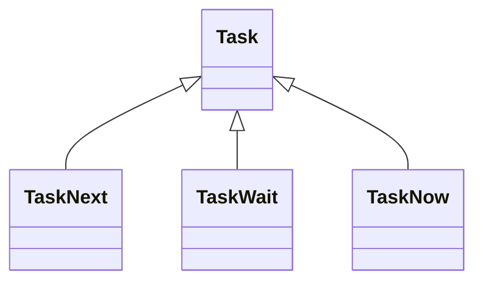

# References

## Terms

* A **note** is a markdown file in a vault or an entry in the database. Notes use the UTF-8 encoding.
* A **task** is a line in a note that contains a `#x`, `#w`, or `#n` **tag**.

## Classes

